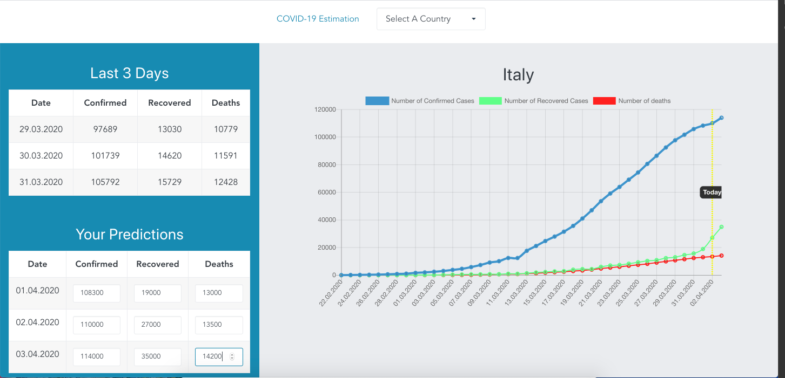

## What is it?
[Live Demo](https://ozanalpay.github.io/)

This tool built for making easy to visualize coronavirus based discussions(. Just enter your predictions for a country, and share chart with your friends. Since I did it in order to not only review my vue.js skills but also give it a try to [inkline](https://inkline.io/) framework, probably there won't be any additional feature/development. But if you add a feature into it, pull requests are more than welcome.

### How to run locally
```
yarn install
yarn serve
```

### Example Screenshot


### Used Open Source libraries
- [Vue.js](https://vuejs.org/)
- [Inkline](https://inkline.io/)
- [Chart.js](https://www.chartjs.org/)
- [moment.js](https://momentjs.com/)

